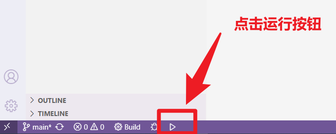
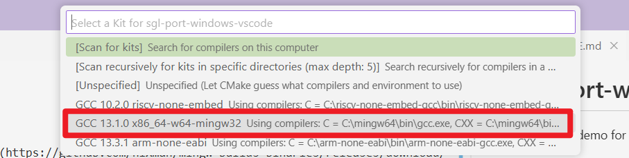
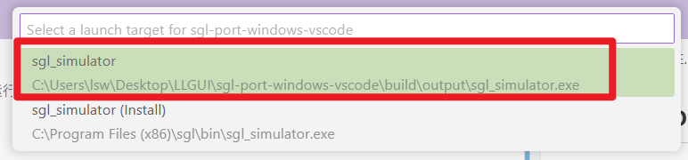

# sgl-port-windows-vscode
A windows demo for SGL
## Quick Start
### 1. install toolchain
Download gcc from this address (https://github.com/niXman/mingw-builds-binaries/releases/download/13.2.0-rt_v11-rev0/x86_64-13.2.0-release-posix-seh-ucrt-rt_v11-rev0.7z) Then extract to any directory and add to   
### 2. git clone https://github.com/sgl-org/sgl-port-windows-vscode.git
### 3. open the sgl-port-windows-vscode with vscode
### 4. 点击运行按钮

### 5. 选择工具链

### 6. 选择sgl_simulator

